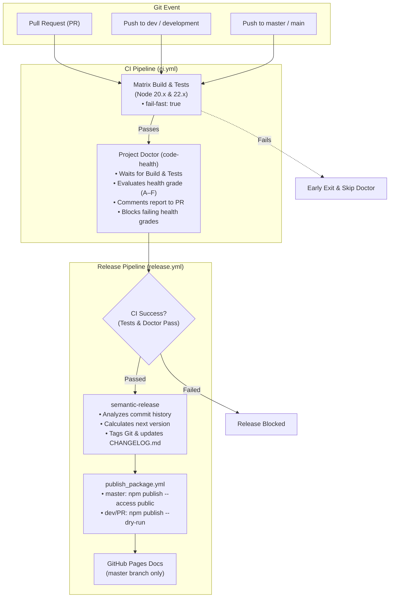

# Unified Release & CI/CD Process

This project uses a highly automated, sequential CI/CD and release pipeline powered by **GitHub Actions** and **`semantic-release`**. This ensures quality control, automated semantic versioning, and secure deployments across web applications, desktop apps, and NPM packages.

---

## Process Flow Diagram



---

## How It Works

### 1. The CI Gatekeeper (`ci.yml`)

Every push and pull request runs through continuous integration with strict **early-exit fail-fast** mechanisms:

1. **Matrix Build & Tests (`build-and-test`):**
   * Compiles all workspaces and the root app across supported Node.js versions (20.x, 22.x) and runs unit test suites.
   * **`fail-fast: true`:** If either Node runner fails, the entire matrix cancels immediately.
2. **Project Doctor (`code-health`):**
   * **`needs: build-and-test`:** Only starts **after** matrix builds and tests pass completely.
   * Runs linters (ESLint, Stylelint), TypeScript type-checking, code formatting (Prettier), and dependency audits.
   * Formats a complete markdown health report and calculates an overall grade (A–F).
   * **On Pull Requests:** Posts or updates a single pinned summary comment on the PR.
   * **On Branch Pushes (`master`/`dev`):** Publishes the report to the GitHub Actions Job Summary.
   * **Release Gate:** Enforces the minimum passing grade (`MIN_PASSING_GRADE`). If the grade drops below the passing threshold, the CI workflow fails, which blocks the release from ever starting.

---

### 2. The Versioning Engine (`release.yml`)

The primary release orchestrator is `.github/workflows/release.yml`.

* **Trigger:** Sequential execution via `workflow_run`—it only triggers **after the `CI` workflow completes with a status of `success`** (all builds, tests, and Doctor checks have passed) on `master`, `main`, `dev`, or `development`.
* **Execution:**
  1. `semantic-release` analyzes commit messages since the last release according to [Conventional Commits](https://www.conventionalcommits.org/).
  2. It computes the appropriate version bump (`feat:` $\rightarrow$ minor, `fix:` $\rightarrow$ patch, `BREAKING CHANGE:` $\rightarrow$ major).
  3. Updates `package.json`, generates `CHANGELOG.md`, tags the Git repository, and publishes GitHub Release notes.
  4. Passes the new version to the target deployment workflow via `workflow_call`.

---

### 3. Environment & Deployment Behaviors

| Stage | Pull Request (PR) | `dev` / Staging | `master` / Production |
| :--- | :--- | :--- | :--- |
| **Project Doctor (`npm run doctor`)** | 🩺 **Runs & comments on PR** | 🩺 **Runs & gates release** | 🩺 **Runs & gates release** |
| **NPM Package Publishing** | 🧪 **Dry Run** (`--dry-run`) | 🧪 **Dry Run** (`--dry-run`) | 🚀 **Live Publish** (`--access public`) |
| **VitePress Docs Deployment** | ⏭️ Skipped | ⏭️ Skipped | 🚀 **Deployed to GitHub Pages** |
| **Semantic Release Tag** | ⏭️ Skipped | 🏷️ Prerelease tag (`v1.0.0-dev.1`) | 🏷️ Official release tag (`v1.0.0`) |
| **Web Hosting (Firebase/Azure)** | 🌐 Ephemeral preview URL | 🌐 Deploys to Staging channel | 🌐 Deploys to Live / Production |
| **Electron & Extensions** | 📦 Local build check | 📦 Pre-release GitHub Release | 📦 Official Latest GitHub Release |

---

## Developer & Agent Responsibilities

> [!IMPORTANT]  
> Because this system is completely automated and sequential, your primary responsibility is to **write meaningful commit messages** following the [Conventional Commits specification](https://www.conventionalcommits.org/en/v1.0.0/). Do not attempt to manually bump versions in `package.json` or manually create release tags.

### Commit Types and Release Triggers

#### Triggers a Release
* **`feat:`** - A new feature. Triggers a **MINOR** version bump (e.g., `1.0.0` $\rightarrow$ `1.1.0`).
* **`fix:`** - A bug fix. Triggers a **PATCH** version bump (e.g., `1.0.0` $\rightarrow$ `1.0.1`).
* **`perf:`** - A code change that improves performance. Triggers a **PATCH** version bump.
* **`BREAKING CHANGE:`** (or `!` after prefix like `feat!:`) - An API breaking change. Triggers a **MAJOR** version bump (e.g., `1.0.0` $\rightarrow$ `2.0.0`).

#### Does NOT Trigger a Release (Safe for internal updates)
* **`docs:`** - Documentation-only changes.
* **`chore:`** - Changes to build process, auxiliary tools, or dependencies.
* **`style:`** - Formatting, whitespace, or missing semi-colons.
* **`refactor:`** - Code changes that neither fix a bug nor add a feature.
* **`test:`** - Adding or updating test suites.
* **`ci:`** - Changes to CI/CD workflows and configuration scripts.

---

### Example Commit Commands

To update documentation without triggering a release:
```bash
git commit -m "docs: update readme with new API instructions"
```

To add a new feature that will be automatically deployed:
```bash
git commit -m "feat: add user authentication"
```
